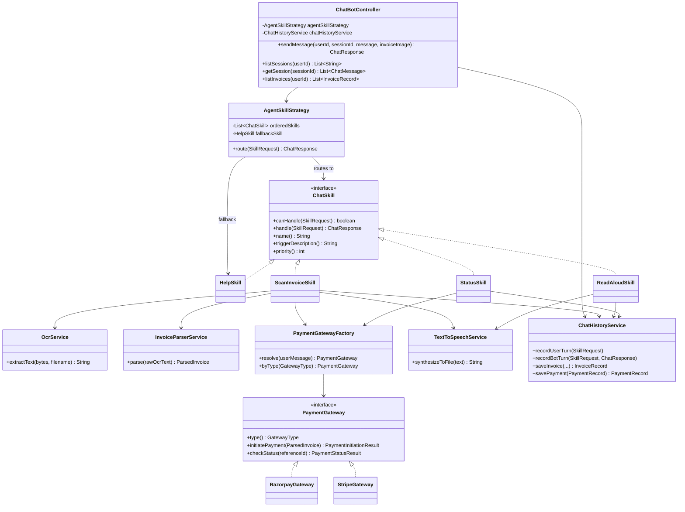
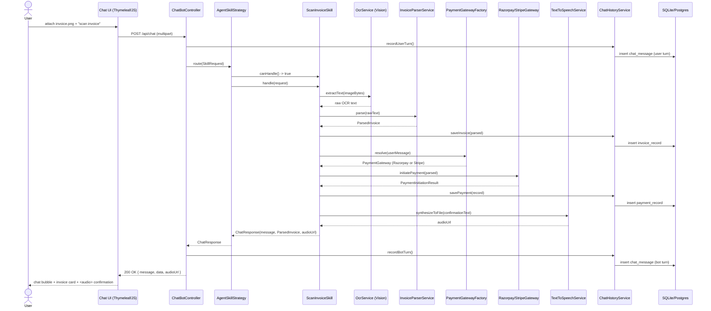

# Architecture

## Class diagram — Controller → Strategy → Skills

## Sequence diagram — "scan invoice" happy path

## Why a Strategy pattern instead of an LLM router

- **Zero marginal token cost per message.** Routing is O(n) keyword/pattern matching across a
  small, fixed skill list — no LLM call in the hot path. The only paid calls are the ones that
  do real work: Vision OCR, Google TTS, and gateway API calls.
- **Deterministic and auditable.** For any given user message, you can compute which skill will
  run *before* running it. That matters when the flow ends in moving money.
- **Cheap to extend.** A sixth skill (e.g. a "cancel payment" or "refund" skill) is a new
  `@Component` implementing `ChatSkill` plus one row in `agent-skills.md` — no router changes.

## Data model

- `chat_message` — every user/bot turn, with the producing skill name, any structured
  `dataJson`, and an optional `audioUrl`. Powers the sidebar's "past conversations" and full
  transcript replay.
- `invoice_record` — every parsed invoice (fields + raw OCR text for audit), linked to the
  session it was scanned in.
- `payment_record` — every gateway response (initiation and subsequent status checks), linked
  to the invoice it was triggered for, including the gateway's raw JSON for audit/dispute
  resolution.

## Scaling path

Start on the default `sqlite` profile for local dev / single-user demos (zero setup, one file).
For multi-user production, activate the `postgres` Spring profile
(`--spring.profiles.active=postgres` or `SPRING_PROFILES_ACTIVE=postgres`) and point `DB_URL` /
`DB_USERNAME` / `DB_PASSWORD` at a real Postgres instance — no code changes required, only the
active profile and its three env vars.
